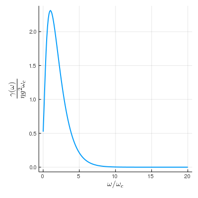
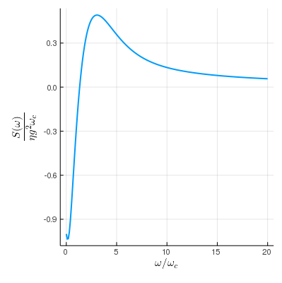

# Bath
We start with a general form of the system-bath interaction Hamiltonian
```math
  H_{SB} = \sum_\alpha S_\alpha\otimes B_\alpha
```
and define each $B_\alpha$ (together with the bath Hamiltonian $H_B$) as an `AbstractBath` object. An important property of any bath is its two-point correlation function
```math
  C(t_1, t_2) = \langle \mathcal{B}(t_1) \mathcal{B}(t_2) \rangle
```
where
```math
  \mathcal{B}(t) = U_B^\dagger (t) B U_B(t)
```
and $U_B(t)$ is the unitary generated by the pure bath Hamiltonian
```math
  U_B(t) = \mathcal{T}\exp\Big\{ -i\int_0^t H_B \mathrm{d}\tau \Big\}
```
The spectral density of the bath is defined as the Fourier transform of the two-point correlation function and is denoted as $\gamma(\omega)$ in `OpenQuantumTools`. It is important to note that only for a Gaussian bath (whose higher order correlations satisfy Wick's Theorem) does the two-point correlation function uniquely determine the bath. Otherwise, high-order correlation functions are necessary. Nevertheless, we only deal with the two-point correlation function in `OpenQuantumTools`.

Currently, there are two built-in concrete types of the `AbstractBath` class -- [`OhmicBath`](@ref) and [`HybridOhmicBath`](@ref).
## Ohmic Bath
A self-consistent reference for the Ohmic bath is [[1] Quantum adiabatic markovian master equations](https://iopscience.iop.org/article/10.1088/1367-2630/14/12/123016/meta). Users can use [`Ohmic`](@ref) function to construct [`OhmicBath`](@ref) object:
```julia
η = 1e-4; fc=4; T=16
bath = Ohmic(η, fc, T);
```
The correlation and spectral density of the bath object can be calculated via
```julia
correlation(τ, bath)
spectrum(ω, bath)
```
This interface is true for every concrete type of `AbstractBath`. However, plotting works differently for different bath models. For `OhmicBath`, the user can use
```julia
ω = range(0, 20, length=200)
plot(bath, :γ, ω)
plot(bath, :S, ω)
```
to conveniently plot the spectral density and the ``S`` function in the Lamb shift terms.




## Hybrid Ohmic Bath
Details of the hybrid ohmic bath model are discussed in [[2] Probing high-frequency noise with macroscopic resonant tunneling](https://journals.aps.org/prb/abstract/10.1103/PhysRevB.83.180502) and [[3] Theory of open quantum dynamics with hybrid noise](https://iopscience.iop.org/article/10.1088/1367-2630/aae79c/meta). The core idea is to assume the noise spectrum can be split into low-frequency and high-frequency parts
```math
  \gamma(\omega) = \gamma_L(ω) + \gamma_H(ω)
```
The high-frequency spectrum $\gamma_H(ω)$ comes from the Ohmic bath and the low frequency spectrum $\gamma_L(ω)$ can be interpreted as an approximation of $1/f$ noise. A benefit of this formalism is that instead of the entire spectral density, $\gamma_L(\omega)$ can be parametrized by a single parameter in a macroscopic resonant tunneling (MRT) experiment. To construct a `HybridOhmicBath` object, run the following command:
```julia
η = 1e-4; fc=4; T=16; W=10
bath = HybridOhmic(W, η, fc, T)
```

## Spin-fluctuator
The spin-fluctuator model is a classical noise model for 1/f noise often found in superconducting qubits [[4] 1/f noise: Implications for solid-state quantum information](http://link.aps.org/doi/10.1103/RevModPhys.86.361). It is a stochastic process generated by summing [telegraph processes](https://en.wikipedia.org/wiki/Telegraph_process)
```math
\sum_{i=1}^{K} n_i(t) \ ,
```
where $n_i(s)$ is the telegraph process that switches randomly between $\pm b_i$ with a rate $\gamma_i$ and $K$ is the total number of fluctuators. Such a noise model can be constructed using [`EnsembleFluctuator`](@ref):
```julia
bvec = 0.2 * ones(10)
γvec = log_uniform(0.01, 1, 10)
fluctuator_ensemble = EnsembleFluctuator(bvec, γvec)
```
The above code block defines a 10-fluctuator ensemble whose $b_i=0.2$ and $\gamma_i$s are log-uniformly distributed within $[0.01, 1]$. More details about simulating stochastic Schrödinger with spin-fluctuator noise can be found in this [tutorial](https://uscqserver.github.io/HOQSTTutorials.jl/html/introduction/06-spin_fluctuators.html).
